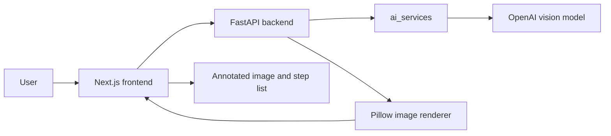

# GuideLens AI

GuideLens AI is a one-page demo app that helps users understand what to do on a UI screenshot.

The user uploads a screenshot and enters a question or goal. The backend sends the image to OpenAI, asks the model to identify useful UI actions, and receives step-by-step guidance with pixel coordinates. The backend then draws those steps directly onto the original image and returns a new annotated output image.

## Before and After

The app starts with a clean upload screen. After the user uploads a screenshot and enters a goal, the AI analyzes the interface, returns the recommended action steps, and the backend draws the guidance directly on top of the image.

| Before analysis | After analysis |
| --- | --- |
|  |  |

## Main Features

- Upload a UI screenshot from the frontend.
- Enter a question or task goal.
- Use AI to analyze the screenshot and identify interaction steps.
- Draw numbered boxes and labels on top of the uploaded image.
- View both the input image and the annotated output image.
- Inspect the returned action steps and coordinates.
- Run the full app with Docker Compose.

## Tech Stack

- Frontend: Next.js, React, Tailwind CSS.
- Backend: FastAPI, Python.
- AI service: OpenAI vision model.
- Image rendering: Pillow.
- Runtime: Docker Compose with separate frontend and backend services.

## Project Architecture



The frontend is responsible for the demo experience: uploading an image, collecting the user's question, and showing the annotated result. The backend receives the file, calls the AI service, renders visual guidance onto the screenshot, and returns everything as JSON.

## Project Structure

```text
.
|-- ai_services/                    # Shared AI logic used by the backend
|   |-- openai_vision.py            # Calls OpenAI to analyze screenshots
|   |-- prompts.py                  # Prompt for JSON steps and coordinates
|   `-- schemas.py                  # Pydantic schemas for AI output
|
|-- backend/                        # FastAPI application
|   |-- app/
|   |   |-- api/routes/             # HTTP endpoints such as /api/analyze
|   |   |-- core/                   # Environment and app configuration
|   |   |-- schemas/                # API request and response schemas
|   |   `-- services/               # Image overlay rendering with Pillow
|   |-- Dockerfile                  # Backend Docker image
|   `-- requirements.txt            # Python dependencies
|
|-- frontend/                       # Next.js demo interface
|   |-- app/                        # App Router pages and global styles
|   |-- Dockerfile                  # Frontend Docker image
|   |-- package.json                # Node dependencies and scripts
|   |-- tailwind.config.ts          # Theme colors and Roboto font setup
|   `-- postcss.config.js           # Tailwind/PostCSS configuration
|
|-- docs/
|   `-- images/
|       |-- app-demo.png            # Before-analysis screenshot shown in this README
|       `-- app-after.png           # After-analysis screenshot shown in this README
|
|-- docker-compose.yml              # Runs frontend and backend together
|-- .env.example                    # Example environment variables
`-- README.md                       # Project guide
```

## How It Works

1. The user opens `http://localhost:3000`.
2. The user uploads a UI screenshot.
3. The user enters a question or goal.
4. The frontend calls `POST /api/analyze`.
5. The backend reads the image, gets its size, and sends it to OpenAI.
6. OpenAI returns JSON containing labels, descriptions, actions, and coordinates.
7. The backend uses Pillow to draw guidance overlays on the original image.
8. The frontend displays the annotated output image and the step list.

## Environment Setup

Create a local `.env` file from the example:

```bash
cp .env.example .env
```

Then edit `.env` and add your OpenAI API key:

```env
OPENAI_API_KEY=sk-your-openai-api-key
OPENAI_MODEL=gpt-5.5-pro

BACKEND_PORT=8000
FRONTEND_PORT=3000

CORS_ORIGINS=http://localhost:3000
NEXT_PUBLIC_API_BASE_URL=http://localhost:8000
```

The backend also supports these alternative API key names:

```env
OPEN_AI_KEY=sk-your-openai-api-key
OPEN_API_KEY=sk-your-openai-api-key
```

## Run With Docker

Build and start the app:

```bash
docker compose up --build
```

After startup:

- Frontend: http://localhost:3000
- Backend health check: http://localhost:8000/health
- API health check: http://localhost:8000/api/health

Run in the background:

```bash
docker compose up -d --build
```

Stop the app:

```bash
docker compose down
```

## Backend API

### `GET /health`

Checks whether the backend is running.

Response:

```json
{
  "status": "ok"
}
```

### `GET /api/health`

Checks whether the API is running and which model is configured.

Response:

```json
{
  "status": "ok",
  "model": "gpt-5.5-pro"
}
```

### `POST /api/analyze`

Analyzes a screenshot and returns an annotated output image.

Form data:

- `file`: the uploaded image file.
- `user_goal`: the user question or goal.

Main response fields:

```json
{
  "source_filename": "screen.png",
  "image_width": 1440,
  "image_height": 900,
  "image_mime_type": "image/png",
  "model_used": "gpt-5.5-pro",
  "summary": "Short summary of the suggested flow",
  "steps": [],
  "warnings": [],
  "original_image_data_url": "data:image/png;base64,...",
  "annotated_image_data_url": "data:image/png;base64,..."
}
```

Each item in `steps` looks like this:

```json
{
  "order": 1,
  "action": "click",
  "target_type": "button",
  "label": "Continue",
  "description": "Click Continue to move to the next step",
  "x": 120,
  "y": 240,
  "width": 180,
  "height": 48,
  "confidence": 0.86
}
```

## Frontend

The frontend currently has one demo page:

- Upload an input screenshot.
- Enter a question or goal.
- View the annotated output image.
- Switch between the input and output images.
- Inspect the returned steps and coordinates.

Current theme:

- Primary background: `#DEE2F2`
- Secondary background: `#F5F5F5`
- Button color: `#E48C3A`
- Font: Roboto

## Quick Checks

Check the backend:

```bash
curl http://localhost:8000/api/health
```

Build the frontend and run TypeScript checks:

```bash
docker compose exec frontend npm run build
```

Compile Python files:

```bash
python3 -m compileall backend ai_services
```

## Common Issues

### The frontend cannot call the backend

Check `NEXT_PUBLIC_API_BASE_URL` in `.env`:

```env
NEXT_PUBLIC_API_BASE_URL=http://localhost:8000
```

After editing `.env`, rebuild and restart:

```bash
docker compose up -d --build
```

### The backend says the API key is missing

Make sure `.env` contains one of these variables:

```env
OPENAI_API_KEY=...
OPEN_AI_KEY=...
OPEN_API_KEY=...
```

### The returned coordinates are not accurate

This demo depends on the model's visual understanding of the screenshot. You can improve results by:

- Uploading a clearer screenshot.
- Writing a more specific goal.
- Tuning the prompt in `ai_services/prompts.py`.
- Adjusting the renderer in `backend/app/services/image_renderer.py`.

## Notes

This version is a single-page demo. It does not include authentication, user accounts, a database, or Supabase. The goal is to demonstrate the full flow: input screenshot -> AI analysis -> action coordinates -> annotated output image.
